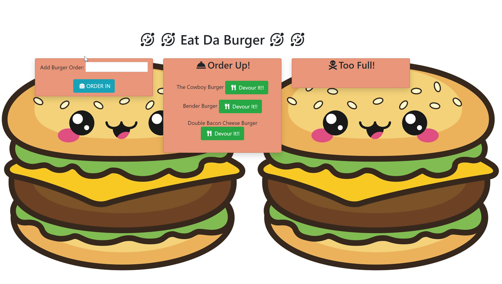

# Burger

## Description
This app connects to a database and gives a user access to add to the database on an HTML page.  Once on the page, the user will be welcomed by a burger image and an input field.  In the input field, the user can add any burger they want.  Once the "Order In" button is pressed, the burger will move to the "Order Up" column.  If the "Devour It!" button is pressed, the burger will move to the "Too Much" column with a "Done" button.  The "Done" button won't do anything.  The "Too Much" column list the burgers from the database after they've been 'devoured'.  

## Local Deployment

1. Clone repo onto your computer and open it on VS code.
2. Run `npm install` on the VS terminal to gather all node_mocules needed to run the code.
3. Run code by typing: `node server.js` or `node server`.
4. Open web brower and go to: http://localhost:8080
5. Add burger of choice and click "Order In".
6. Click "Devour It!" when burger moves to "Order Up" column to move it to "Too Much" column.

## Deployable App
You can find the deployed app here:
https://stark-gorge-80987.herokuapp.com/

Follow instructions 5 and 6 in Local Deployemnt.

## Built with

-Node

-JawsDB

-Heroku

-HTML

-CSS

-Javascript

-jQuery

-Font Awesome

-Bootstrap

-MySql Workbench

## Packages Used

-Express

-Express Handlebars

-MySQL

## Images of Deployed app
